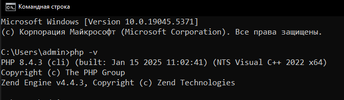
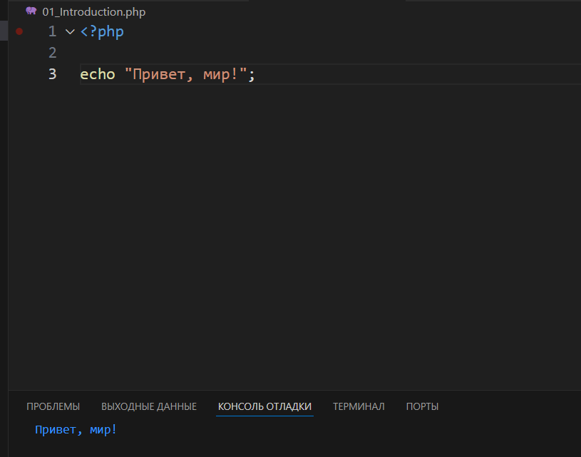
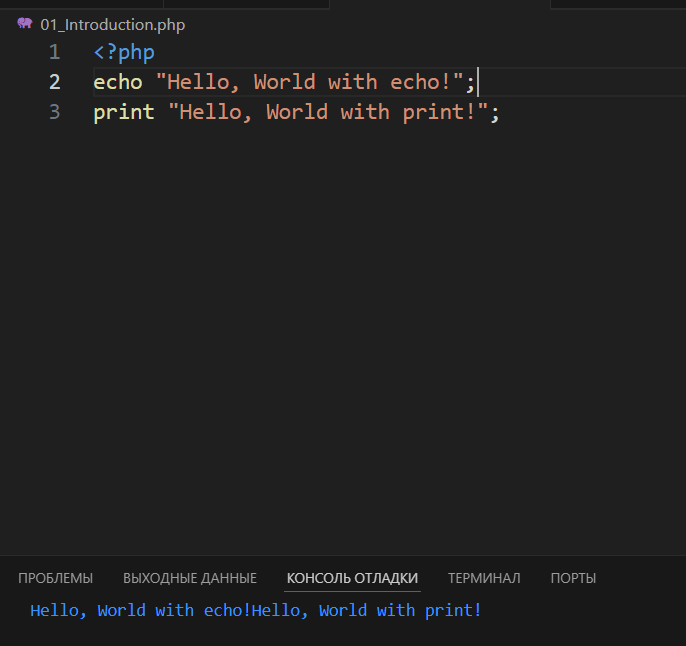
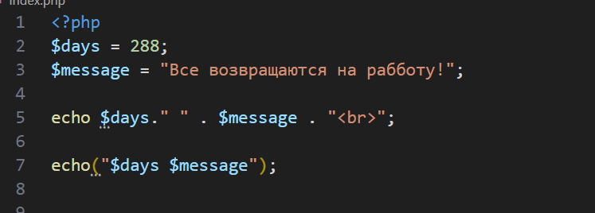
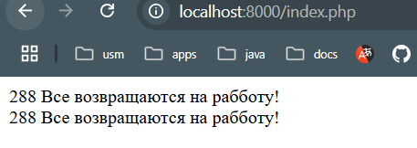
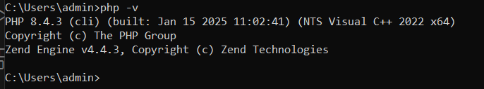

## Установка php

1) Для устаноыки требоавлось скачать php с офиц сайта и разархивировать его в папку на диске С.
2) После данных манипуляций добавляем переменную среды в Path казывающую на папку с php

* Проверяем установку
 

3) Вствка и вывод требуемого кода

4) Вывод с посощью print and echo 

5) Конкатенация строк

* Вывод

## Контрольные вопросы

1) Существуют два способа установки ПХП. 
 * Первый это загрузка архива php с офиц.сайта, деархивация в нужную паку, добавление перевенной среды и запуск сервера через терминал.
 * Второц способ предпологает более быструю среды с помощью установки XAMPP. Запуск XAMPP Control Panel и включение Apache.

2) Проверка наличия установки ПХП используется путем ввода в конслоли в команду: php -v.

3) Echo является более быстрым способом вывода.
 * print всегда возвращает 1, а echo нисего не возвращает.
 * в echo мы можем передавать несколько аргументов, передвая их через точку(конкатенация). в print такая конструкция вызовет ошибку.